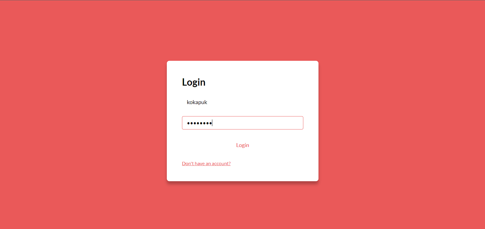
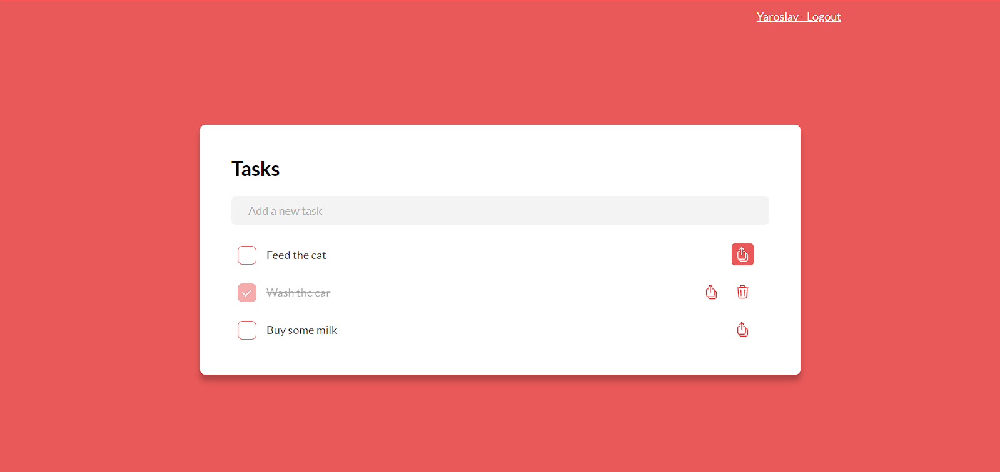

# ToDo

- On Backend **(JavaScript)**
  - [Express](https://expressjs.com)
  - [express-validator](https://express-validator.github.io)
  - [JSON Web Tokens](https://jwt.io)
  - [MongoDB](https://www.mongodb.com) / [mongoose](https://mongoosejs.com)
  - [bcrypt](https://www.npmjs.com/package/bcrypt)
- On Frontend **(TypeScript)**
  - [Vite](https://vitejs.dev)
  - [React](https://react.dev)
  - [React Router](https://reactrouter.com/en/main)
  - [React Transition Group](https://reactcommunity.org/react-transition-group)
  - [Axios](https://axios-http.com)

# 

# 
